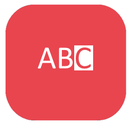

# Indiko.Maui.Controls.SelectableLabel

The `SelectableLabel` control is a custom label for MAUI applications that provides selectable text capabilities with extensive customization options. This control supports various text properties and formatted text, making it versatile for creating rich, interactive labels in cross-platform apps.


## Build Status


## Installation

You can install the `Indiko.Maui.Controls.SelectableLabel` package via NuGet Package Manager or CLI:

[](https://www.nuget.org/packages/Indiko.Maui.Controls.selectable Label/)

### NuGet Package Manager
```bash
Install-Package Indiko.Maui.Controls.SelectableLabel
```

### .NET CLI
```bash
dotnet add package Indiko.Maui.Controls.SelectableLabel
```


## Features

- **Text Selection**: Allows text to be selectable, enabling users to copy text from the label.
- **Customizable Appearance**: Supports various font attributes, colors, alignments, decorations, and line settings.
- **Formatted Text**: Enables multiple text spans with individual properties within a single label.


### Usage

To install `SelectableLabel` in your MAUI application, add the following code to your `MauiProgram.cs` file:

```csharp
using Indiko.Maui.Controls.SelectableLabel;

public static MauiApp CreateMauiApp()
{
    var builder = MauiApp.CreateBuilder();
    builder
        .UseMauiApp<App>()
        .UseSelectableLabel(); // Add this line to enable SelectableLabel handler

    return builder.Build();
}
```


```xml
<ContentPage xmlns="http://schemas.microsoft.com/dotnet/2021/maui"
             xmlns:x="http://schemas.microsoft.com/winfx/2009/xaml"
             xmlns:idk="clr-namespace:Indiko.Maui.Controls.SelectableLabel"
             x:Class="YourNamespace.YourPage">

    <idk:SelectableLabel
        Text="This is a selectable label"
        TextColor="Blue"
        BackgroundColor="LightGray"
        FontSize="18"
        FontAttributes="Bold"
        LineHeight="1.5"
        MaxLines="2"
        HorizontalTextAlignment="Center"
        VerticalTextAlignment="Center"
        CharacterSpacing="0.1" />
</ContentPage>
```

### Bindable Properties

| Property              | Description                                                   | Default       |
|-----------------------|---------------------------------------------------------------|---------------|
| `Text`                | The text content displayed by the label.                      | `string.Empty`|
| `TextColor`           | The color of the text.                                        | `Black`       |
| `BackgroundColor`     | The background color of the label.                            | `Transparent` |
| `FontAttributes`      | Font style (e.g., `Bold`, `Italic`).                          | `None`        |
| `FontSize`            | Size of the font.                                             | Platform default|
| `FontFamily`          | Custom font family for the text.                              | `string.Empty`|
| `LineBreakMode`       | Text wrapping and truncation mode.                            | `TailTruncation`|
| `TextDecorations`     | Decoration options like `Underline` and `Strikethrough`.      | `None`        |
| `TextTransform`       | Text case transformation (`Uppercase`, `Lowercase`).          | `None`        |
| `LineHeight`          | The height of each text line.                                 | Platform default|
| `MaxLines`            | Maximum number of lines to display.                           | `-1` (No limit)|
| `HorizontalTextAlignment` | Horizontal alignment of the text.                         | `Start`       |
| `VerticalTextAlignment`   | Vertical alignment of the text.                           | `Start`       |
| `CharacterSpacing`    | Spacing between characters in em units.                       | `-1.0`        |
| `FormattedText`       | Richly formatted text with individual spans.                  | `null`        |

### Using Formatted Text

`FormattedText` allows for multiple text spans with individual attributes.

```xml
<idk:SelectableLabel>
    <idk:SelectableLabel.FormattedText>
        <FormattedString>
            <Span Text="Hello, " FontAttributes="Bold" TextColor="Red"/>
            <Span Text="world!" FontAttributes="Italic" TextColor="Blue" />
        </FormattedString>
    </idk:SelectableLabel.FormattedText>
</idk:SelectableLabel>
```

## Platform-specific Implementations

`SelectableLabel` uses platform-specific handlers to achieve cross-platform compatibility. On Android, it leverages `TextView` with selectable properties, while on iOS, `UITextView` provides similar functionality.

## Contributing

Contributions to the `SelectableLabel` project are very welcome! Whether you want to add new features, improve existing ones, fix bugs, or enhance documentation, your help is highly appreciated.

### How to Contribute

1. **Fork the Repository**: Start by forking the repository on GitHub.
2. **Clone Your Fork**: Clone the forked repository to your local machine.
3. **Create a Branch**: Create a new branch for your feature or bugfix.
    ```bash
    git checkout -b feature/new-feature
    ```
4. **Add Your Changes**: Make your changes or add new features. Be sure to include any necessary tests and documentation updates.
5. **Commit Your Changes**: Use clear and descriptive commit messages.
    ```bash
    git commit -m "Add support for new selectable Label feature"
    ```
6. **Push the Changes**: Push your branch to GitHub.
    ```bash
    git push origin feature/new-feature
    ```
7. **Create a Pull Request**: Submit a pull request (PR) from your branch to the main repository. Provide a detailed description of what your changes do and how they improve the control.

We encourage contributions that enhance the control, such as:
- Support for additional selectable Label syntax.
- New styling properties for customization.
- Performance improvements.
- Bug fixes.

### Guidelines

- Ensure that your code follows good practices and is clean.
- Update the documentation to reflect any new features or changes.

If you have any ideas or questions about contributing, feel free to open an issue on GitHub to discuss it with the maintainers.

We look forward to your contributions!
## License

This project is licensed under the MIT License.
